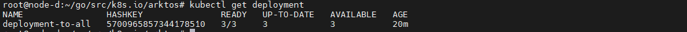

# Fornax End-to-End Test for 2021-8-30 Release

### Test Case 1: Register Hierarchical Edge Clusters with Cloud

### Step 1: 
### start kubeedge cloudcore in the root operator machine, using command:
```bash
_output/local/bin/cloudcore
```
### Output:


#### Kubeedge cloudcore started successfully

### Step 2:
###  Run the following command in the root operator machine to verify that NO edge cluster is registered.
### Command:
```bash
kubectl get edgeclusters
```
### Output:


### No cluster is registered.

### Step 3:
### In Cluster B machine, start the edgecore in edge-cluster mode, with command
```bash
_output/local/bin/edgecore --edgecluster
```
### Output:


### Edgecore cluster started successfully.

### Step 4:
###  Wait 10-20 seconds, in the root operator machine, verify that the edge-cluster B shows up in the command ouput of
```bash
kubectl get edgeclusters
```
### Output:

### edge-cluster B shows up in the root operator machine.

### Step 5:
### In cluster B machine, start cloudcore
```bash
_output/local/bin/cloudcore
```
### Output:

### Cloudcore started successfully.

### Step 6:
### In Cluster C machine, start the edgecore in edge-cluster mode, with command
```bash
_output/local/bin/edgecore --edgecluster
```
### Output:

### Edgecore started successfully.

### Step 7:
### Wait 30-40 seconds, in Cluster A machine, verify that the C is shown as a sub-edge-cluster of edge-cluster B in the command ouput of
```bash
kubectl get edgeclusters
```

### Output:

###  Node C is showing as subcluster of edge-cluster B.

### Step 8:
###  In cluster C machine, start cloudcore
```bash
_output/local/bin/cloudcore
```

### Output:

### Cloudcore started successfully.

### Step 9:
### In Cluster D machine, start the edgecore in edge-cluster mode, with command
```bash
_output/local/bin/edgecore --edgecluster
```

### Output:

### Edge cluster registered successfully.

### Step 10:
### Wait 50-60 seconds, in Cluster A machine, run command,
```bash
kubectl get edgeclusters
```
### Output:

### Node d is showing as subcluster.
### The clusters C and C/D (C/D mean D is a sub-cluster of C) are shown as sub-edge-clusters of edge-cluster B.

## Test case 1 - Passed
#

### Test Case 2: Check edge cluster status when disconnected from the cloud.

### Step 1: Kill the process of edgecore in cluster B machine.
### Output:

### Killed the process on cluster B.

### Step 2: Wait for 2 minutes. Run the command in the root operator machine,
```bash
kubectl get edgeclusters
```
### Output:
### Before killing the process

### After killing the process

###  The edge cluster B exists but its state is "Disconnected".
###  The info of "SubEdgeClusters" C and C/D is cleared.
## Test case 2 - Passed
#
### Test case 3: An edge cluster re-connects to the cloud.
### Step 1:  In cluster B machine, restart the edgecore in edge-cluster mode, using command
```bash
_output/local/bin/edgecore --edgecluster
```
### Output:

### Edgecore in cluster b machine restarted successfully.

### Step 2: Wait 10-20 seconds, verify that the state of the edge-cluster B is "healthy" in the command ouput
```bash
kubectl get edgeclusters
```
### Output:

### Edge-cluster B is healthy, the states of cluster C and C/D are displayed in the section of "SubEdgeClusters".
## Test case 3 - Passed
#
### Test case 4: Deploy workload (deployment) to edge clusters using mission
### Step 1: Run the command in the root operator machine.
```bash
kubectl apply -f tests/edgecluster/data/missions/deployment-to-all.yaml
```
### Output:

### Workload deployed sucessfully.

### Step 2: Run the following command to verify the mission is deployed and the status of the mission is shown and updated regularly.
```bash
kubectl get missions
```
### Output:

### Mission is deployed on all the cluster nodes.

### Step 3: Run the following command, with [edge_cluster_kubeconfig] set to the kubeconfig files of cluster B, C and D respectively.
```bash
kubectl get deployment --kubeconfig=[edge_cluster_kubeconfig]
```
### Output:
#### Node B:


#### Node C:


#### Node D:

### Deployment specified in the mission content is created in the edge clusters of B, C, D.
## Passed
# 

### Test case 5:  An edge cluster continues to work when disconnected from the cloud.
### Step 1: Kill the process of edgecore in cluster B.
#### Process killed on cluster B.

### Step 2: Verify that the deployment created via missions in the previous test case is still active in each edge cluster.
### Output:
### Node B:

### Node C:

### Node D:


### The deployment created via missions in the previous test case is still active in each edge cluster.
## Passed
#

### Test Case 6: An edge cluster conintues to monintor its sub-edge-clusters when disconnected from cloud.
### Step 1:  Run command
```bash
kubectl get edgecluster --kubeconfig=[cluster_B_kubeconfig]
```
### Output:

###  The info of edge cluster C is displayed correctly.

### Step 2: Run command
```bash
kubectl get mission --kubeconfig=[cluster_B_kubeconfig]
```
### Output:


### The info of mission deployment-to-all is displayed correctly.
## Passed
#

### Test Case 7:  Deploy workload (job) to edge clusters using mission. (After reconnect the cluster)
### Step 1: Run the command in the root operator machine.
```bash
kubectl apply -f tests/edgecluster/data/missions/job-to-all.yaml
```
### Output:

### Workload (job) deployed successfully.

### Step 2: Run the following command to verify the mission is deployed.
```bash
kubectl get missions
```
### Output:

### The mission is deployed successfully.

### Step 3: Run the following command, with [edge_cluster_kubeconfig] set to the kubeconfig files of cluster B, C and D respectively.
```bash
kubectl get jobs --kubeconfig=[edge_cluster_kubeconfig]
```
### Node B:

### Node C:

### Node D:


### The job specified in the mission content is not created in each edge cluster even after successful workload (job) deployment.
## Failed
#

### Test Case 8: Check mission status using command "kubectl get missions".
### Step 1: Run command and watch the output for 1 minute.
```bash
watch kubectl get missions
```
### Output:


### The the status of the deployed mission are shown correctly and automatically updated. The name of the edge cluster (B, B/C, B, C and D) and the status of the mission content(deployment/job) are shown in pairs.
## Passed
#

### Test case 9: Update workload to edge clusters using mission
### Step 1: Note down the number of replicas of the deployment specified in the mission content of tests/edgecluster/data/missions/deployment-to-all.yaml
### Output

### No. of replicas are 3.

### Step 2: Change the number of deployment replicaset number in the mission content of tests/edgecluster/data/missions/deployment-to-all.yaml.
### Chenged Replicas from 3 to 4.


### Step 3: Run and verify the following command returns successfully.
```bash
kubectl apply -f tests/edgecluster/data/missions/deployment-to-all.yaml
```
### Output:


### Step 4:  Run the following command, with [edge_cluster_kubeconfig] set to the kubeconfig files of cluster B, C and D respectively.
```bash
kubectl get deployment --kubeconfig=[edge_cluster_kubeconfig]
```
### Output:


### The number of replicas in the deployment created via mission in each edge cluster is updated.
## Passed
#

### Test case 10: The mission status of a cluster is "cluster unreachable" if cluster disconnected.
### Step 1: Kill the edgecore process in cluster C and wait for 2 minutes.
### Killed the process in cluster c.

### Step 2: Run the following command.
```bash
kubectl get missions
```
### Output:

### a. the mission status of cluster B/C is "cluster unreachable". 
### b. the status of the cluster under B/C, namely B/C/D, is cleared.
## Passed
#

### Test case 11: Delete workload to edge clusters using mission.
### Step 1: Run and verify the following command returns successfully.
```bash
kubectl delete -f tests/edgecluster/data/missions/deployment-to-all.yaml
```
### Output

### Mission deleted successfully.

### Step 2: Run the following command to verify the mission is deleted.
```bash
kubectl get missions
```
### Output:

### Mission (deployment-to-all) deleted successfully.

### Step 3:  Run the following command, with [edge_cluster_kubeconfig] set to the kubeconfig files of cluster B, C and D respectively.

```bash
kubectl get deployment --kubeconfig=[edge_cluster_kubeconfig]
```
### Output:
### Node B:

### Node C:

### Node D:

### The deployment specified in the mission content is gone in each edge cluster.
## Passed
#

### Test case 12: Deploy workload to an edge cluster with a specific name.
### Step 1:  Update tests/edgecluster/data/missions/deployment-to-given-clusters.yaml to change the value of spec/placement/cluster/Name to be the name of cluster C.

### Name changed to 'Cluster C'.

### Step 3: Run and verify the following command returns successfully.
```bash
kubectl apply -f tests/edgecluster/data/missions/deployment-to-given-clusters.yaml
```
### Output:


### Step 3:  Run the following command to verify the mission is deployed in cluster A, B, C and D, with [edge_cluster_kubeconfig] set to the kubeconfig files of cluster A, B, C and D respectively.

```bash
kubectl get missions --kubeconfig=[edge_cluster_kubeconfig]
```
### Output:
### Node A:


### Node B:


### Node C:


### Node D:

### Mission is deployed on each cluster.

### Step 4: Run the following command, with [edge_cluster_kubeconfig] set to the kubeconfig files of cluster B, C and D respectively.
```bash
kubectl get deployment --kubeconfig=[edge_cluster_kubeconfig]
```
### Output:
### Node A:
 

### Node B:


### Node C:


### Node D:


### The deployment specified in the mission content is created in cluster C only.

### Step 5: In the root operator machine, run command:
```bash
kubectl get mission 
```
### Output:

### The mission states of cluster B and B/C/D are reported as "not match", while the state of cluster B/C is deployment-to-arktos2 of the deployment.
## Passed
#

### Test case 13: Deploy workload to selective edge clusters with given labels.
### Step 1: Double check the /etc/kubeedge/config/edgecore.yaml files in the cluster B, C and D and make sure only Cluster D has the label of "company" : "futurewei".
 ### Output:
 ### Node B:
 

 ### Node C:
 

 ### Node D:
 

 ### Only Cluster D has the label of "company" : "futurewei".

 ### Step 2:  Run and verify the following command returns successfully.
 ```bash
 kubectl apply -f tests/edgecluster/data/missions/deployment-to-given-labels.yaml
 ```

 ### Output:
 

 ### Step 3: Run the following command to verify the mission is deployed in cluster A, B, C and D, with [edge_cluster_kubeconfig] set to the kubeconfig files of cluster A, B, C and D respectively.

 ### Output:
 ### Node A:
 
 ### Node B:
 
 ### Node C:
 
 ### Node D:

 ### The mission is deployed in cluster A, B, C and D, with [edge_cluster_kubeconfig] set to the kubeconfig files of cluster A, B, C and D respectively.

### Step 4: Run the following command, with [edge_cluster_kubeconfig] set to the kubeconfig files of cluster B, C and D respectively.
```bash
kubectl get deployment --kubeconfig=[edge_cluster_kubeconfig]
```
# Output:
### Node A:

### Node B: 

### Node C:

### Node D:


### The deployment is created in Cluster D only.

Step 5: In the root operator machine, run command:
```bash
kubectl get mission 
```
### Output:

### The mission states of cluster B and B/C are reported as "not match", while the state of cluster B/C/D is deployment-to-label-smart.
## Passed
#

### Test Case 14:  The information in the edge cluster status.
### Step 1: Run Command in the root operator machine.
```bash
kubectl get edgeclusters
```
### Output:
Verified. 
a. LastHeartBeat

b. HealthStatus: should be "healthy"

c. SubEdgeClusters: should include "C" and "C/D"

d. Received_Missions

e. Matched_Missions


## Passed
#

### Test Case 15: An edge cluster picks up the new mission added during its disconnection when reconnected to the cloud.
### Step 1: delete all the missions deployed using command.
```bash
kubectl delete mission [mission_name]
```
### Output:


### Step 2: Killed the process of edgecore in cluster B.
### Step 3: Run the following command and verify it returns successfully.
```bash
kubectl apply -f tests/edgecluster/data/missions/deployment-to-all.yaml
```
### Output:


### Step 4: Run command, with [edge_cluster_kubeconfig] set to the kubeconfig files of cluster B, C and D respectively.
```bash
kubectl get missions --kubeconfig=[edge_cluster_kubeconfig]
```
### Output:
### Node B:

### Node C:

### Node D:

### The mission is NOT created in the edge clusters B, C and D.

### Step 5: Run command, with [edge_cluster_kubeconfig] set to the kubeconfig files of cluster B, C and D respectively.
```bash
kubectl get deployment --kubeconfig=[edge_cluster_kubeconfig]
```
### Output:
### Node B:

### Node C:

### Node D:

 ### The deployment specified in the mission content is NOT created in the edge clusters B, C and D.

 ### Step 6: Restart the edgecore in edge-cluster mode and wait 20 seconds.
 ```bash
 edgecore --edgecluster
 ```
 ### Output:
 
 ### Restarted edgecore cluster 

 ### Step 7:
 Run command, with [edge_cluster_kubeconfig] set to the kubeconfig files of cluster B, C and D respectively.
 ```bash
 kubectl get missions --kubeconfig=[edge_cluster_kubeconfig]
 ```
 ### Output:
 ### Node B:
 
 ### Node C:
 
 ### Node D:
 
 ### The mission is created in the edge clusters B, C and D.

 ### Step 8: Run command , with [edge_cluster_kubeconfig] set to the kubeconfig files of cluster B, C and D respectively.
 ```bash
 kubectl get deployment --kubeconfig=[edge_cluster_kubeconfig]
 ```

### Output:
### Node B:

### Node C:

### Node D:


### The deployment specified in the mission content is created in the edge clusters B, C and D.
## Passed.
#

### Test Case 16: An edge cluster picks up the change when reconnected if the mission is updated during its disconnection.
### Step 1: Kill the process of edgecore in Cluster B.
### Killed.

### Step 2:  Update the number of replicas in deployment spec in the mission content of tests/edgecluster/data/missions/deployment-to-all.yaml.
### Output:
### Updated the replica count from 3 to 6.


### Step 3: Run the following command and verify it returns successfully
```bash
kubectl apply -f tests/edgecluster/data/missions/deployment-to-all.yaml
```
### Output:


### Step 4: Run command, with [edge_cluster_kubeconfig] set to the kubeconfig files of cluster B, C and D respectively.
```bash
kubectl get missions --kubeconfig=[edge_cluster_kubeconfig] -o json
```
### Output:
### Node B:

### Node C:

### Node D:

### The mission content is NOT updated in the edge clusters B, C and D.

### Step 5: Run command, with [edge_cluster_kubeconfig] set to the kubeconfig files of cluster B, C and D respectively.
```bash
kubectl get deployment --kubeconfig=[edge_cluster_kubeconfig]
```
### Output:
### Node B:

### Node C:

### Node D:

### The replica number of the deployment created via mission is NOT updated in the edge clusters B, C and D.

### Step 6: Restart the edgecore in edge-cluster mode in cluster B. Wait 20 seconds

### Restarted Cluster

### Step 7: Run command, with [edge_cluster_kubeconfig] set to the kubeconfig files of cluster B, C and D respectively.
```bash
kubectl get missions --kubeconfig=[edge_cluster_kubeconfig] -o json
```
### Output:
### Node B:

### Node C:

### Node D:

### The mission content is updated in the edge clusters B, C and D.

### Step 8: Run command, with [edge_cluster_kubeconfig] set to the kubeconfig files of cluster B, C and D respectively.
```bash
kubectl get deployment --kubeconfig=[edge_cluster_kubeconfig]
```
### Output:
### Node B:

### Node C:

### Node D:

### The number of replicas in the deployment are getting updated in the edge clusters B, C and D.
## Passed
#

### Test Case 17: An edge cluster deletes a mission when reconnected if the mission is deleted during its disconnection.
### Step 1: Kill the process of edgecore in cluster B.
### Killed.

### Step 2: Run the following command and verify it returns successfully.
```bash
kubectl delete -f tests/edgecluster/data/missions/deployment-to-all.yaml
```
### Output:


### Step 3: Run command , with [edge_cluster_kubeconfig] set to the kubeconfig files of cluster B, C and D respectively.
```bash
kubectl get missions --kubeconfig=[edge_cluster_kubeconfig] -o json
```
### Output:
### Node B:

### Node C:

### Node D:

### The mission content is NOT deleted in the edge clusters B, C and D.

### Step 5: Run command, with [edge_cluster_kubeconfig] set to the kubeconfig files of cluster B, C and D respectively.
```bash
kubectl get deployment --kubeconfig=[edge_cluster_kubeconfig]
```
### Output:
### Node B:

### Node C:

### Node D:

### The replica number of the deployment created via mission is still active in the edge clusters B, C and D.

### Step 6: Restart the edgecore in edge-cluster mode in cluster B and wait 20 seconds.
### Restarted.

### Step 7: Run command with [edge_cluster_kubeconfig] set to the kubeconfig files of cluster B, C and D respectively.
```bash
kubectl get missions --kubeconfig=[edge_cluster_kubeconfig]
```
### Output:
### Node B:

### Node C:

### Node D:

### The mission is deleted in the edge clusters B, C and D.

### Step 8: Run command with [edge_cluster_kubeconfig] set to the kubeconfig files of cluster B, C and D respectively.
```bash 
kubectl get deployment --kubeconfig=[edge_cluster_kubeconfig]
```

### Output:
### Node B:

### Node C:

### Node D:


### The deployment created via mission is gone in the edge clusters B, C and D.
##Passed
#

### Test Case 18: The mission content deleted in edge cluster will be re-instated.
### Step 1: Run the following command to deploy the mission.
```bash
kubectl apply -f tests/edgecluster/data/missions/deployment-to-all.yaml
```
### Output:


Step 2: Run command verify the deployment specified in the mission is deployed in the edge cluster B.
```bash
kubectl get deployment --kubeconfig=[cluster_B_kubeconfig]
```
### Output:
### Node B:


### Step 3: Run command to delete the deployment.
```bash
kubectl delete deployment [deployment_name] --kubeconfig=[cluster_B_kubeconfig]
```
### Output:


### Step 4: Verify the deployment specified in the mission is deleted (Note: do it immediately after the previous step).
```bash
kubectl get deployment --kubeconfig=[cluster_B_kubeconfig]
```
### Output:


### Step 5: Wait 20 seconds, run command to verify the deployment specified in the mission is back.
```bash
kubectl get deployment --kubeconfig=[cluster_B_kubeconfig]
```
### Output:

### The deployment specified in the mission is back
## Passed.
#

### Test Case 19: The mission content changed in edge cluster will be reverted automatically.

### Step 1: Run the following command to deploy the mission.
```bash
kubectl apply -f tests/edgecluster/data/missions/deployment-to-all.yaml
```
### Output:


### Step 2: Run command and verify the deployment specified in the mission is deployed in the edge cluster B.
```bash
kubectl get deployment --kubeconfig=[cluster_B_kubeconfig]
```
### Output:


### Step 3: Run command to scale the deployment.
```bash
kubectl scale deployment.v1.apps/[deployment_name] -rreplicas=10 --kubeconfig=[cluster_B_kubeconfig]
```
### Output:


### Command is incorrect.
### Tried with the new command.
```bash
kubectl scale deployment.v1.apps/deployment-to-all --replicas=10
```
### Output:


### Step 4: Verify the number of replicas in deployment specified in the mission is changed to 10 (Note: do it immediately after the previous step).
```bash
kubectl get deployment --kubeconfig=[cluster_B_kubeconfig]
```
### Output:
### Refer previous image. 

### Step 8: Wait 20 seconds, verify the number of the replicas in the deployment specified in the mission is reverted to the original value.
```bash
kubectl get deployment --kubeconfig=[cluster_B_kubeconfig]
```
### Output:

### The number of the replicas in the deployment specified in the mission is reverted to the original value.
## Passed.
#

### Test Case 20: The status of edge cluster is "Unhealthy" if the clusterd is connected but the underlying cluster is unreachable.
### Step 1: Stop the arktos-up.sh script in cluster D.
### Stopped.
### Step 2: Make sure the edgecore in cluster D is still running.

### Step 3: Wait 20 seconds and check the "HealthStatus" of Cluster D in the output of the following command is "Unhealthy".
```bash
kubectl get edgeclusters --kubeconfig=[cluster_C_kubeconfig]
```
### Output:


### Step 4: Run the command in the root operator machine.
```bash
kubectl get edgeclusters 
```
### Output:

### the state of SubEdgeCluster C/D is "unhealthy".
## Passed.
#
# Application deployment test (Facial recognition application).

### On node A:
### Step 1: Check the yaml files.
```bash
root@node-a:~/fornax/tests/edgecluster/data/ai_app# ls
```
### Output:


### Step 2: Apply application files.
```bash
/fornax/tests/edgecluster/data# kubectl apply -f ai_app
```
### Output:


### Step 3: Check whether the missions are created or not.
```
kubectl get missions
```
### Output:


### Check Deployment status on node B:
### 1. Check missions.

### Missions are created.

### 2. Check deployments.

### Deployments are created.

### 3. Check PV.


### 4. Check PVC.


### 5. Check Pods:


###  Two deployments (face-recog, mysql ) are not in a ready state.
###  Two pods (face-recog-698dc6b88f-b8str, mysql-67ff5f6bf4-khsj4) are stuck in pending state.

### MySQL persistent volume claim is in pending state, because persistent volume is not getting created.
### No yaml file available to create pv.
## Deployment failed.


